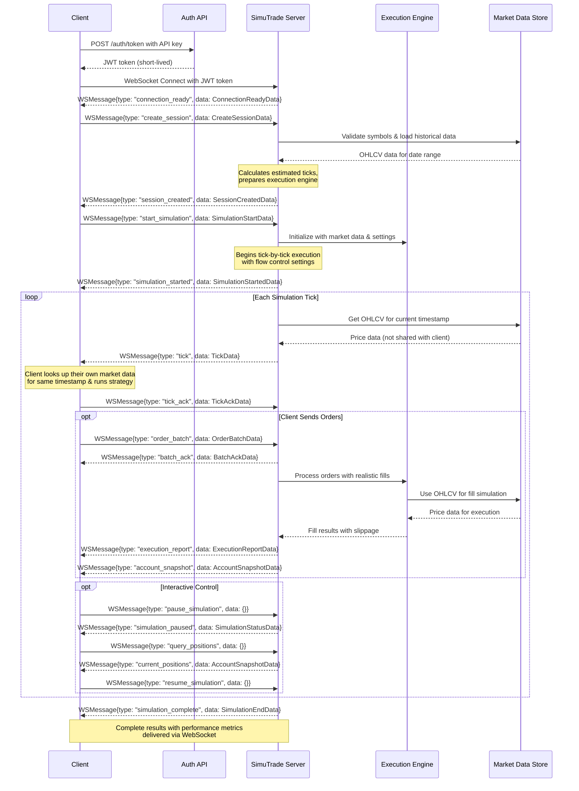

# SimuTrade WebSocket API v2.0

High-fidelity trading simulator API for developers and quantitative traders. Test your strategies against historical data with realistic execution modeling while keeping your proprietary logic completely private.

## 🎯 **Core Concepts**

### **Data Separation Model**

- **Client responsibility**: Obtain and manage your own market data
- **Server responsibility**: Validate orders against the server's copy of the same data
- **Synchronization**: Both sides use identical data sources, different access methods
- **Privacy**: Server never sees your market data or strategy logic

### **Simulation Approach**

- **Time progression**: Server advances simulation time tick-by-tick
- **Order execution**: Server simulates realistic fills based on historical market conditions
- **Client control**: Client controls simulation pace through tick acknowledgments
- **State management**: Server maintains portfolio state, client maintains strategy state

### **Client-Server Responsibilities**

```
Client Side:                    Server Side:
- Market data access           - Order validation
- Strategy logic               - Execution simulation
- Order generation             - Portfolio tracking
- Simulation control           - Performance calculation
```

## 📋 **API Overview**

SimuTrade uses a **WebSocket-only architecture** for the simulation API:

- **WebSocket API**: Complete simulation lifecycle - authentication, session creation, real-time execution, and results
- **Admin Dashboard**: Separate system for account management and API key generation (not part of simulation API)

### **How It Works**

1. **Get API key** from a separate admin dashboard/account management system
2. **Exchange API key for JWT** via REST endpoint - get short-lived access token
3. **Connect WebSocket** with JWT token - server validates and establishes authenticated session
4. **Create session** via WebSocket specifying symbols, date range, and data provider
5. **Start simulation** with flow control settings
6. **Receive ticks** with timestamps only (no market data shared)
7. **Send orders** based on your strategy logic and local data
8. **Get realistic fills** with slippage, commissions, and latency modeling
9. **Control simulation** interactively (pause, resume, query state)
10. **Receive final results** when simulation completes
11. **Connection closes** automatically after simulation or due to timeouts/limits

## � **Execution Engine** _(TBD)_

_Details on order execution simulation, slippage modeling, and fill logic to be added._

## 📊 **Market Data Integration** _(TBD)_

_Supported data providers, symbol coverage, and data quality specifications to be added._

## ⚡ **Performance & Limits** _(TBD)_

_Throughput specifications, concurrent session limits, and operational constraints to be added._

## � **Authentication & Authorization**

### **Authentication Flow**

SimuTrade uses a two-step JWT-based authentication process:

**Step 1: Token Exchange (REST)**

```bash
POST /auth/token
X-API-Key: sk_live_1234567890abcdef

Response: {
  "access_token": "eyJ0eXAiOiJKV1QiLCJhbGciOiJIUzI1NiJ9...",
  "expires_in": 3600,
  "token_type": "Bearer",
  "user_id": "user_12345",
  "plan": "professional"
}
```

**Step 2: WebSocket Connection**

```bash
ws://api.simutrade.com/ws/simulate?token=eyJ0eXAiOiJKV1QiLCJhbGciOiJIUzI1NiJ9...
```

### **Security Benefits**

- **Easy key rotation**: Revoke API keys without disrupting active connections
- **Short-lived tokens**: Limit exposure if token is compromised (1 hour expiry)
- **Industry standard**: Aligns with broker and financial API patterns
- **Stateless validation**: Server can validate JWT without database lookups

### **Authorization Model**

- **User Isolation**: API key identifies user and enforces access controls
- **Resource Limits**: Plan-based limits on symbols, duration, concurrent sessions
- **Rate Limiting**: Tiered limits based on user's subscription plan
- **Session Ownership**: Users can only access simulations created with their API key

### **API Key Management**

API keys are obtained from a separate admin dashboard system that handles:

- Account management and billing
- API key generation and rotation
- Usage monitoring and rate limit configuration
- User plan management

## 🔄 **Connection Management & Lifecycle**

### **Connection Duration Limits**

WebSocket connections have time-based limits to ensure security and resource management:

```python
CONNECTION_LIMITS = {
    "free": {
        "max_connection_duration_sec": 3600,      # 1 hour
        "idle_timeout_sec": 1800,                 # 30 minutes
        "max_simulation_duration_sec": 86400,     # 24 hours
        "concurrent_connections": 1
    },
    "professional": {
        "max_connection_duration_sec": 28800,     # 8 hours
        "idle_timeout_sec": 3600,                 # 1 hour
        "max_simulation_duration_sec": 604800,    # 1 week
        "concurrent_connections": 10
    },
    "enterprise": {
        "max_connection_duration_sec": 86400,     # 24 hours
        "idle_timeout_sec": 7200,                 # 2 hours
        "max_simulation_duration_sec": 31536000,  # 1 year
        "concurrent_connections": 100
    }
}
```

### **Connection Closure Scenarios**

**Automatic Closure:**

- **Simulation completion**: Connection closes after `simulation_complete` message
- **Maximum duration reached**: Connection time limit exceeded
- **Idle timeout**: No client activity for specified duration
- **API key revoked**: Key disabled in admin dashboard
- **Rate limits exceeded**: Too many requests or concurrent connections
- **Server maintenance**: Planned system maintenance

**Client-Initiated Closure:**

- Client application closes WebSocket connection
- Client sends explicit disconnect message

**Network-Initiated Closure:**

- Network disconnection or instability
- Client application crash
- Firewall or proxy timeouts

### **Connection Warnings & Grace Periods**

Server provides warnings before forced closure:

```json
// Warning 5 minutes before timeout
{
  "type": "connection_warning",
  "data": {
    "warning_type": "approaching_timeout",
    "message": "Connection will expire in 5 minutes",
    "expires_at": "2024-01-01T16:00:00Z",
    "action_required": "complete_simulation_or_reconnect"
  }
}

// Final warning 1 minute before closure
{
  "type": "connection_warning",
  "data": {
    "warning_type": "imminent_closure",
    "message": "Connection closing in 60 seconds",
    "expires_at": "2024-01-01T16:00:00Z",
    "action_required": "save_state_and_reconnect"
  }
}
```

### **Graceful Connection Closure**

```json
// Server notifies before closing
{
  "type": "connection_closing",
  "data": {
    "reason": "idle_timeout",
    "message": "Connection idle for 30 minutes",
    "close_code": 4000,
    "reconnect_allowed": true,
    "session_state": "preserved_for_resume"
  }
}
// WebSocket closes with specified code
```

---

## ⚡ **Rate Limiting**

### **Rate Limit Tiers**

```python
class UserPlan(str, Enum):
    free = "free"
    professional = "professional"
    enterprise = "enterprise"

# Rate limits per plan
RATE_LIMITS = {
    "free": {
        "sessions_per_hour": 5,
        "concurrent_sessions": 1,
        "orders_per_minute": 100,
        "max_simulation_hours": 24,
        "max_symbols_per_session": 5,
        "websocket_connections": 1
    },
    "professional": {
        "sessions_per_hour": 50,
        "concurrent_sessions": 10,
        "orders_per_minute": 1000,
        "max_simulation_hours": 168,  # 1 week
        "max_symbols_per_session": 50,
        "websocket_connections": 10
    },
    "enterprise": {
        "sessions_per_hour": 500,
        "concurrent_sessions": 100,
        "orders_per_minute": 10000,
        "max_simulation_hours": 8760,  # 1 year
        "max_symbols_per_session": 500,
        "websocket_connections": 100
    }
}
```

### **Rate Limit Errors**

```json
{
  "type": "error",
  "data": {
    "error_code": "RATE_LIMIT_EXCEEDED",
    "message": "Too many sessions created",
    "error_type": "rate_limit",
    "severity": "error",
    "recoverable": true,
    "retry_after_ms": 3600000,
    "context": {
      "limit": "5 sessions/hour",
      "current_usage": 6,
      "reset_time": "2024-01-01T16:00:00Z",
      "plan": "free"
    }
  }
}
```

---

## **Message Flow Overview**



### **Quick Reference**

**Authentication:** `POST /auth/token` (API key) → JWT token → WebSocket connect
**Configuration:** `create_session` → `session_created` (validates symbols, loads data)
**Execution:** `start_simulation` → `simulation_started` (begins tick flow)
**Simulation:** `tick` → `tick_ack` → `order_batch` → `execution_report` → repeat
**Completion:** `simulation_complete` → connection closes

> **Note:** Session creation and simulation start are separate steps - configure first, then execute. This allows validation of symbols/data availability before committing to simulation execution.

### **Complete Simulation Lifecycle**

```
1. REST: POST /auth/token (API key) → JWT token
2. WebSocket: Connect with JWT token
3. WS: connection_ready ← Server confirms authentication
4. WS: create_session → Configure simulation parameters
5. WS: session_created ← Server validates and confirms
6. WS: start_simulation → Begin execution
7. WS: simulation_started ← Server confirms start
8. WS: tick ← Server advances time (repeated)
9. WS: tick_ack → Client confirms ready (repeated)
10. WS: order_batch → Client sends orders (as needed)
11. WS: execution_report ← Server reports fills (as needed)
12. WS: simulation_complete ← Simulation finished
13. Connection closes automatically
```

### **Error Recovery & Reconnection**

```
1. Connection drops during simulation
2. REST: POST /auth/token → Get new JWT (if expired)
3. WebSocket: Reconnect with JWT token
4. WS: connection_ready ← Server confirms reconnection
5. WS: resume_session → Request session resume
6. WS: state_sync ← Server synchronizes current state
7. Continue simulation from last processed tick
```

---

## 📋 **Core Message Types**

| Message Type          | Direction       | Purpose                            | Requires Response          |
| --------------------- | --------------- | ---------------------------------- | -------------------------- |
| `connection_ready`    | Server → Client | Connection established with limits | No                         |
| `create_session`      | Client → Server | Create simulation session          | Yes (`session_created`)    |
| `session_created`     | Server → Client | Session validated and ready        | No                         |
| `start_simulation`    | Client → Server | Begin simulation execution         | Yes (`simulation_started`) |
| `simulation_started`  | Server → Client | Simulation execution began         | No                         |
| `tick`                | Server → Client | Time advancement                   | Yes (`tick_ack`)           |
| `tick_ack`            | Client → Server | Confirm tick receipt               | No                         |
| `order_batch`         | Client → Server | Submit batch of orders             | Yes (`batch_ack`)          |
| `batch_ack`           | Server → Client | Order batch acceptance             | No                         |
| `execution_report`    | Server → Client | Order fill notification            | No                         |
| `account_snapshot`    | Server → Client | Account state update               | No                         |
| `simulation_complete` | Server → Client | Simulation finished                | No                         |
| `connection_warning`  | Server → Client | Connection timeout warning         | No                         |
| `connection_closing`  | Server → Client | Connection closure notification    | No                         |
| `resume_session`      | Client → Server | Resume after disconnect            | Yes (`state_sync`)         |
| `state_sync`          | Server → Client | State synchronization              | No                         |
| `error`               | Server → Client | Error with recovery info           | No                         |

---

## 🧾 **Data Models**

```python
from pydantic import BaseModel, Field
from typing import Literal, Optional, List, Dict, Any
from datetime import datetime
from enum import Enum
from decimal import Decimal

# ===== CORE MESSAGE ENVELOPE =====

class WSMessage(BaseModel):
    """All WebSocket messages use this envelope."""
    type: str                           # Message type
    data: Dict[str, Any]               # Payload (simple dict for JSON safety)
    request_id: Optional[str] = None   # For request/response correlation
    timestamp: datetime                # Message timestamp
    sequence_id: Optional[int] = None  # For message ordering
    # Authentication context (populated by server)
    user_id: Optional[str] = None      # For multi-tenant logging and authorization

# ===== ENUMS =====

class DataProvider(str, Enum):
    polygon = "polygon"
    alpaca = "alpaca"
    iex = "iex"

class UserPlan(str, Enum):
    """User subscription plans with different rate limits."""
    free = "free"
    professional = "professional"
    enterprise = "enterprise"

class OrderSide(str, Enum):
    buy = "buy"
    sell = "sell"

class OrderType(str, Enum):
    market = "market"
    limit = "limit"
    stop = "stop"
    stop_limit = "stop_limit"

class OrderStatus(str, Enum):
    pending = "pending"
    accepted = "accepted"
    rejected = "rejected"
    partially_filled = "partially_filled"
    filled = "filled"
    cancelled = "cancelled"

class SessionState(str, Enum):
    initializing = "initializing"
    ready = "ready"
    running = "running"
    paused = "paused"
    completed = "completed"
    error = "error"

# ===== AUTHENTICATION =====

class TokenRequest(BaseModel):
    """REST API: Request JWT token (API key sent in header)."""
    # API key sent in X-API-Key header, no body needed
    pass

class TokenResponse(BaseModel):
    """REST API: JWT token response."""
    access_token: str
    expires_in: int                    # Token lifetime in seconds
    token_type: str = "Bearer"
    user_id: str
    plan: UserPlan

class UserLimitsResponse(BaseModel):
    """REST API: Current user rate limits."""
    plan: UserPlan
    limits: Dict[str, int]             # Current limits
    usage: Dict[str, int]              # Current usage
    reset_times: Dict[str, datetime]   # When limits reset

# ===== WEBSOCKET SESSION MANAGEMENT =====

class CreateSessionData(BaseModel):
    """WebSocket: Create new simulation session."""
    session_id: str
    symbols: List[str]                 # Multi-asset support
    start: datetime
    end: datetime
    data_provider: DataProvider = DataProvider.polygon
    data_version: str = "adjusted"
    initial_cash: Decimal
    commission_per_share: Decimal = Decimal("0.005")
    slippage_bps: int = 5              # Basis points

class SessionCreatedData(BaseModel):
    """WebSocket: Session creation confirmation."""
    session_id: str
    estimated_ticks: int               # Total ticks in simulation
    symbols_loaded: List[str]          # Confirmed symbols with data available
    data_range_actual: Dict[str, Any]  # Actual data availability per symbol

# ===== WEBSOCKET MESSAGES =====

class ConnectionReadyData(BaseModel):
    """Server confirms WebSocket connection and authentication."""
    user_id: str
    plan: UserPlan
    server_time: datetime
    connection_expires_at: datetime
    idle_timeout_sec: int
    max_simulation_duration_sec: int
    concurrent_connections_limit: int
    supported_features: List[str]      # ["batch_orders", "partial_fills", "interactive_control"]

class ConnectionWarningData(BaseModel):
    """Server warns about impending connection closure."""
    warning_type: Literal["approaching_timeout", "imminent_closure", "rate_limit_warning"]
    message: str
    expires_at: Optional[datetime] = None
    action_required: str
    seconds_remaining: Optional[int] = None

class ConnectionClosingData(BaseModel):
    """Server notifies about connection closure."""
    reason: Literal["idle_timeout", "max_duration", "api_key_revoked", "rate_limit", "simulation_complete", "server_maintenance"]
    message: str
    close_code: int                    # WebSocket close code
    reconnect_allowed: bool
    session_state: Optional[str] = None  # "preserved_for_resume", "lost", "completed"

class SimulationStartData(BaseModel):
    """Client requests simulation start."""
    flow_control: bool = True          # Enable tick acknowledgments
    max_pending_ticks: int = 1         # Backpressure control
    account_update_frequency: Literal["every_fill", "every_tick", "on_demand"] = "every_fill"

class SimulationStartedData(BaseModel):
    """Server confirms simulation has begun."""
    session_id: str
    started_at: datetime
    estimated_duration_sec: int
    tick_interval_ms: int              # Time between ticks
    flow_control_enabled: bool

class TickData(BaseModel):
    """Server advances simulation time."""
    sim_time: datetime
    sequence_id: int                   # For ordering guarantees
    market_session: Literal["pre_market", "regular", "after_hours"]
    symbols_trading: List[str]         # Which symbols are tradeable now
    is_eod: bool = False

class TickAckData(BaseModel):
    """Client acknowledges tick and signals readiness."""
    sequence_id: int                   # Echo from TickData
    processing_status: Literal["ready", "processing", "need_time"]
    orders_pending: int = 0            # How many orders client will send
    max_wait_ms: int = 1000           # How long client needs

# ===== ORDER MANAGEMENT =====

class OrderData(BaseModel):
    """Individual order within a batch."""
    order_id: str
    symbol: str
    side: OrderSide
    type: OrderType
    quantity: Optional[int] = None
    notional: Optional[Decimal] = None  # Alternative to quantity
    price: Optional[Decimal] = None     # For limit orders
    stop_price: Optional[Decimal] = None
    time_in_force: Literal["day", "gtc", "ioc"] = "day"

class OrderBatchData(BaseModel):
    """Client submits batch of orders."""
    batch_id: str
    orders: List[OrderData]
    execution_mode: Literal["atomic", "best_effort"] = "best_effort"
    parent_strategy: Optional[str] = None  # For tracking

class BatchAckData(BaseModel):
    """Server acknowledges order batch."""
    batch_id: str
    accepted_orders: List[str]         # order_ids that were accepted
    rejected_orders: Dict[str, str]    # order_id -> rejection_reason
    estimated_fills: Dict[str, Decimal] # order_id -> estimated_fill_price

class ExecutionReportData(BaseModel):
    """Server reports order execution."""
    execution_id: str
    order_id: str
    symbol: str
    side: OrderSide
    executed_quantity: int
    executed_price: Decimal
    execution_time: datetime
    commission: Decimal
    slippage_bps: int
    is_partial: bool
    remaining_quantity: int
    fill_reason: str                   # "market_open", "limit_touched", etc.

# ===== ACCOUNT & PORTFOLIO =====

class PositionData(BaseModel):
    """Current position in a symbol."""
    symbol: str
    quantity: int                      # Positive = long, negative = short
    avg_cost: Decimal
    market_value: Decimal
    unrealized_pnl: Decimal

class AccountSnapshotData(BaseModel):
    """Current account state."""
    cash: Decimal
    equity: Decimal
    buying_power: Decimal
    day_pnl: Decimal
    positions: List[PositionData]
    open_orders: int

# ===== ERROR HANDLING =====

class ErrorData(BaseModel):
    """Enhanced error reporting."""
    error_code: str                    # "INVALID_ORDER", "INSUFFICIENT_FUNDS", etc.
    message: str
    error_type: Literal["validation", "execution", "connection", "data"]
    severity: Literal["warning", "error", "fatal"]
    recoverable: bool
    retry_after_ms: Optional[int] = None
    failed_request_id: Optional[str] = None
    context: Dict[str, Any] = {}

# ===== SESSION RECOVERY =====

class ResumeSessionData(BaseModel):
    """Client requests session resume after disconnect."""
    session_id: str
    last_processed_sequence_id: int
    client_state_hash: Optional[str] = None

class StateSyncData(BaseModel):
    """Server provides current state for recovery."""
    current_sim_time: datetime
    next_sequence_id: int
    account_snapshot: AccountSnapshotData
    pending_orders: List[str]          # order_ids still open
    missed_executions: List[ExecutionReportData]  # Fills during disconnect

# ===== SIMULATION END =====

class SimulationEndData(BaseModel):
    """Final simulation results."""
    session_id: str
    final_equity: Decimal
    total_return_pct: Decimal
    total_trades: int
    winning_trades: int
    total_commission: Decimal
    max_drawdown_pct: Decimal
    sharpe_ratio: Optional[Decimal] = None
    sortino_ratio: Optional[Decimal] = None
    calmar_ratio: Optional[Decimal] = None
    simulation_duration_sec: int
```

---

## 🔄 **Complete Message Flow Examples**

### **Example 1: Complete Simulation Flow**

```json
// 1. REST: Exchange API key for JWT token
POST /auth/token
X-API-Key: sk_live_1234567890abcdef

Response: {
  "access_token": "eyJ0eXAiOiJKV1QiLCJhbGciOiJIUzI1NiJ9...",
  "expires_in": 3600,
  "token_type": "Bearer",
  "user_id": "user_12345",
  "plan": "professional"
}

// 2. WebSocket: Connect with JWT token
ws://api.simutrade.com/ws/simulate?token=eyJ0eXAiOiJKV1QiLCJhbGciOiJIUzI1NiJ9...

→ {"type": "connection_ready", "data": {
    "user_id": "user_12345",
    "plan": "professional",
    "connection_expires_at": "2024-01-01T22:30:00Z",
    "idle_timeout_sec": 3600,
    "max_simulation_duration_sec": 604800,
    "concurrent_connections_limit": 10
  }}

// 2. WebSocket: Create session
← {"type": "create_session", "data": {
    "session_id": "strategy_test_001",
    "symbols": ["AAPL", "MSFT"],
    "start": "2024-01-01T14:30:00Z",
    "end": "2024-01-01T21:00:00Z",
    "data_provider": "polygon",
    "initial_cash": "100000.00"
  }, "request_id": "req_001"}

→ {"type": "session_created", "data": {
    "session_id": "strategy_test_001",
    "estimated_ticks": 390,
    "symbols_loaded": ["AAPL", "MSFT"]
  }, "request_id": "req_001"}

// 3. WebSocket: Start simulation
← {"type": "start_simulation", "data": {
    "flow_control": true,
    "max_pending_ticks": 1
  }, "request_id": "req_002"}

→ {"type": "simulation_started", "data": {
    "session_id": "strategy_test_001",
    "started_at": "2024-01-01T14:30:00Z",
    "flow_control_enabled": true
  }, "request_id": "req_002"}

// 4. Simulation loop
→ {"type": "tick", "data": {"sim_time": "2024-01-01T14:30:00Z", "sequence_id": 1}}
← {"type": "tick_ack", "data": {"sequence_id": 1, "processing_status": "ready", "orders_pending": 2}}

← {"type": "order_batch", "data": {
    "batch_id": "batch_001",
    "orders": [
      {"order_id": "ord_001", "symbol": "AAPL", "side": "buy", "type": "market", "quantity": 100},
      {"order_id": "ord_002", "symbol": "MSFT", "side": "buy", "type": "limit", "quantity": 50, "price": "380.00"}
    ]
  }, "request_id": "req_003"}

→ {"type": "batch_ack", "data": {
    "batch_id": "batch_001",
    "accepted_orders": ["ord_001", "ord_002"],
    "rejected_orders": {},
    "estimated_fills": {"ord_001": "180.25", "ord_002": "380.00"}
  }, "request_id": "req_003"}

→ {"type": "execution_report", "data": {
    "execution_id": "exec_001",
    "order_id": "ord_001",
    "symbol": "AAPL",
    "executed_quantity": 100,
    "executed_price": "180.27",
    "commission": "0.50",
    "slippage_bps": 1
  }}

→ {"type": "account_snapshot", "data": {
    "cash": "81972.50",
    "equity": "100000.00",
    "positions": [{"symbol": "AAPL", "quantity": 100, "avg_cost": "180.27"}]
  }}

// 5. Simulation completion
→ {"type": "simulation_complete", "data": {
    "session_id": "strategy_test_001",
    "final_equity": "105000.00",
    "total_trades": 25,
    "sharpe_ratio": "1.85"
  }}

// 6. Connection closes automatically after simulation
```

### **Example 2: Session Resume After Disconnection**

```json
// Client reconnects after network issue
// First get new JWT token (if previous one expired)
POST /auth/token
X-API-Key: sk_live_1234567890abcdef

Response: {"access_token": "eyJ...", "expires_in": 3600}

// Then reconnect with JWT token
ws://api.simutrade.com/ws/simulate?token=eyJ0eXAiOiJKV1QiLCJhbGciOiJIUzI1NiJ9...

→ {"type": "connection_ready", "data": {...}}

// Client requests session resume
← {"type": "resume_session", "data": {
    "session_id": "strategy_test_001",
    "last_processed_sequence_id": 45
  }, "request_id": "req_resume"}

→ {"type": "state_sync", "data": {
    "current_sim_time": "2024-01-01T15:15:00Z",
    "next_sequence_id": 46,
    "account_snapshot": {...},
    "missed_executions": [
      {"execution_id": "exec_012", "order_id": "ord_008", ...}
    ]
  }, "request_id": "req_resume"}

// Continue normal simulation from sequence_id 46
```

---

## 🛡️ **Error Handling Strategy**

### **Error Categories**

```python
# Validation Errors (4xx equivalent)
{
  "type": "error",
  "data": {
    "error_code": "INVALID_ORDER_QUANTITY",
    "message": "Order quantity must be positive",
    "error_type": "validation",
    "severity": "error",
    "recoverable": true,
    "failed_request_id": "req_002",
    "context": {"order_id": "ord_001", "quantity": -100}
  }
}

# Execution Errors (business logic)
{
  "type": "error",
  "data": {
    "error_code": "INSUFFICIENT_BUYING_POWER",
    "message": "Not enough cash to execute order",
    "error_type": "execution",
    "severity": "warning",
    "recoverable": true,
    "context": {"required": "50000.00", "available": "25000.00"}
  }
}

# System Errors (5xx equivalent)
{
  "type": "error",
  "data": {
    "error_code": "DATA_PROVIDER_UNAVAILABLE",
    "message": "Unable to fetch market data",
    "error_type": "data",
    "severity": "fatal",
    "recoverable": false,
    "retry_after_ms": 30000
  }
}
```

---
